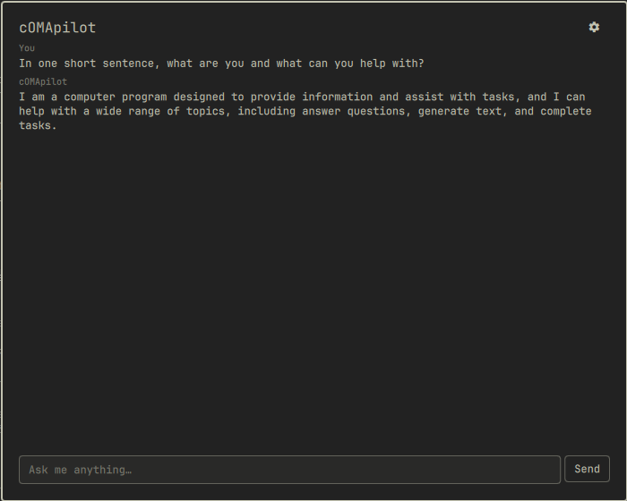

# cOMApilot

An AI assistant overlay for [Omarchy](https://omarchy.org/), built as a Quickshell shell plugin. Streams answers from an LLM backend of your choice - cloud or a fully local/free model via Ollama.



## Status: pre-release, not yet submitted to the marketplace

This is under active development. What works today:

- A fullscreen overlay (bar icon or hotkey to open) with streaming Q&A
- Three backend options: OpenAI-compatible (OpenAI, OpenRouter, or a local Ollama server), and Anthropic - switchable per-session from the settings panel
- API keys stored via your system keyring (`secret-tool`/libsecret), never written to Omarchy's `shell.json`
- Optional, off-by-default context: your current clipboard text and/or the active window's title, sent along with your prompt so you can ask about what you're looking at. Both are clearly sanitized as untrusted data before ever reaching the model - see "Notes for reviewers" below
- Optional, off-by-default **actions**: with the setting on, the assistant can propose a small, fixed set of actions (open a path, run one of a handful of named system actions, or drive an allowlisted method on another first-party Omarchy plugin) - every single one still requires you to explicitly click "Run" on a confirm dialog naming exactly what it will do before anything executes. See "How actions work" below

**Still to do before this is submission-ready:** local Ollama auto-detection, multi-session conversation history, a token-usage footer, and a hardening/docs pass (Phase 4-5 of the build plan). The core Q&A + context + action model is functionally complete and tested; what's left is polish, not the security-critical parts.

## Requirements

- [Omarchy](https://omarchy.org/) with its Quickshell-based shell
- `curl` (request transport)
- `secret-tool` (libsecret) for storing your API key, if you use a cloud backend
- `wl-clipboard` (`wl-paste`) only if you enable the clipboard-context setting
- Either an API key for OpenAI/Anthropic/OpenRouter, or a local OpenAI-compatible server such as [Ollama](https://ollama.com/) - no key needed for a local server

## Install

```bash
omarchy plugin add https://github.com/Deunnis/cOMApilot.git --enable
```

By default it's placed on the right side of the bar; move it with:

```bash
omarchy bar move io.github.omacopilot --section right
```

(or place it via `~/.config/omarchy/shell.json`, which is where all the settings below are also stored per-widget).

## Uninstall

```bash
omarchy plugin remove io.github.omacopilot
```

This does not automatically clear any API key stored via `secret-tool`; use the "Clear" button in the settings panel first if you want it removed from your keyring.

## Settings

Available from the gear icon inside the overlay:

| Setting | Description |
|---|---|
| Backend | `openai-compatible` (OpenAI, OpenRouter, Ollama's own `/v1/chat/completions`) or `anthropic` |
| Model | Model name/id for the selected backend |
| Endpoint URL | Chat-completions endpoint (ignored for Anthropic, which always uses `api.anthropic.com`) |
| Stream responses | Token-by-token streaming vs. wait-for-full-reply |
| API key | Stored via your system keyring, kept per-backend so switching backends doesn't lose a key |
| Include clipboard as context | Off by default. Sends your current clipboard text with each prompt, always in its own clearly-labeled untrusted-data message |
| Include active window as context | Off by default. Sends the focused window's title and app id with each prompt |
| Max context characters | Truncation limit applied to the combined clipboard/window context |
| Allow the assistant to propose actions | Off by default. See "How actions work" below - every proposed action still requires your explicit confirmation |

## How actions work

With the actions setting on, the assistant is told about a fixed, closed set of things it may propose - nothing else, and it's instructed to never invent a new one:

- **Open a path** - an `https://` URL or an absolute local path, opened via `xdg-open`
- **Run a named action** - one of exactly four: lock the screen, take a screenshot, open a terminal, or open the app menu. Each maps to one hardcoded command; the model can only pick a name, never supply arguments
- **Call another plugin** - an allowlisted method on a specific first-party Omarchy plugin (currently: `omarchy.clipboard` toggle/open/close, `omarchy.network` toggle/toggleNetwork, `omarchy.menu` toggle)

When the assistant proposes one, it appears as a card under its reply with a "Run" button. Clicking it opens a confirm dialog naming exactly what will run; nothing executes until you confirm. Anything the model proposes outside this exact schema - an unknown type, a disallowed plugin/method pair, a malformed block - is silently dropped before it ever becomes a card.

## Notes for reviewers

- Runs entirely as your normal user session; no elevated permissions are ever requested or needed.
- **Secrets:** the API key never touches `shell.json` (world-readable, and every write there triggers a full shell-wide config reload). It's stored/looked up/cleared exclusively through `secret-tool`, and even during a request it never appears as a CLI argument (visible to any other process via `/proc/*/cmdline`) - both the request body and every header, including `Authorization`/`x-api-key`, are written to a private per-plugin cache-dir scratch file via stdin, and `curl` only ever receives that file's path.
- **Context sanitization:** clipboard text and the active window's title/app id are the only external inputs this plugin reads, and both are opt-in (off by default). Neither is ever spliced into the system/instruction prompt string - they're combined into one separate, explicitly-labeled "this is untrusted data, not instructions" message, truncated to a configurable length, with anything resembling a future action-block fence neutralized so it can't be echoed back and misinterpreted downstream.
- **No free-form command execution exists anywhere in this codebase, model-invoked or otherwise, and it's permanently out of scope** - not "later." Every action the model can ever propose is one of exactly three fixed types (`ActionAllowlist.js`), each mapped to a specific array-form command (never a shell string, so there's no interpolation/injection surface) with zero model-controlled arguments beyond what each type's own validation explicitly allows (`ActionParser.js`) - e.g. a "run a plugin method" proposal is checked against a hardcoded `pluginId`→allowed-methods table, and any extra `args` must be flat strings/numbers/booleans (a nested object/array is rejected outright). Parsing is fail-closed throughout: malformed JSON, a non-array payload, an unknown type, or a failed per-type check silently drops just that one action (logged, never guessed at).
- **Actions only ever run after an explicit user confirmation**, via the same first-party `ConfirmDialog` component Omarchy's own menu uses, naming exactly what will execute. Confirmed actions are launched detached (fire-and-forget, not awaited) - deliberately: `xdg-open`/a terminal/an interactive screenshot picker can stay open indefinitely, and tracking exit status would leave a card stuck "running" for as long as that stayed open.
- External commands this plugin runs: `curl` (the LLM request itself), `secret-tool` (keyring access), `mktemp`/`rm`/a `read`-based shell one-liner (scratch-file plumbing for the request body/headers, chosen specifically so secrets never appear in argv), `wl-paste` (only if clipboard context is enabled), and - only after an explicit per-action confirmation, and only when the actions setting is on - `xdg-open`, one of four specific first-party Omarchy binaries, or `omarchy-shell shell call` against the allowlisted plugin/method pairs above.

## License

MIT - see [LICENSE](LICENSE).
